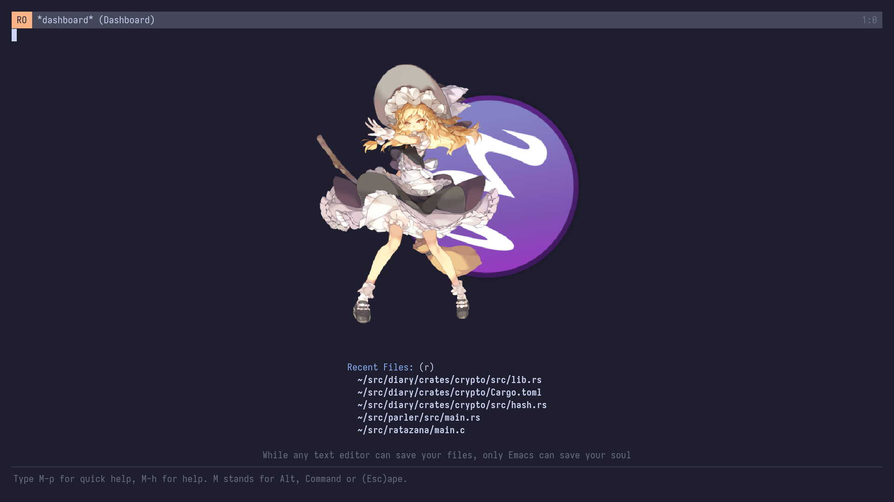
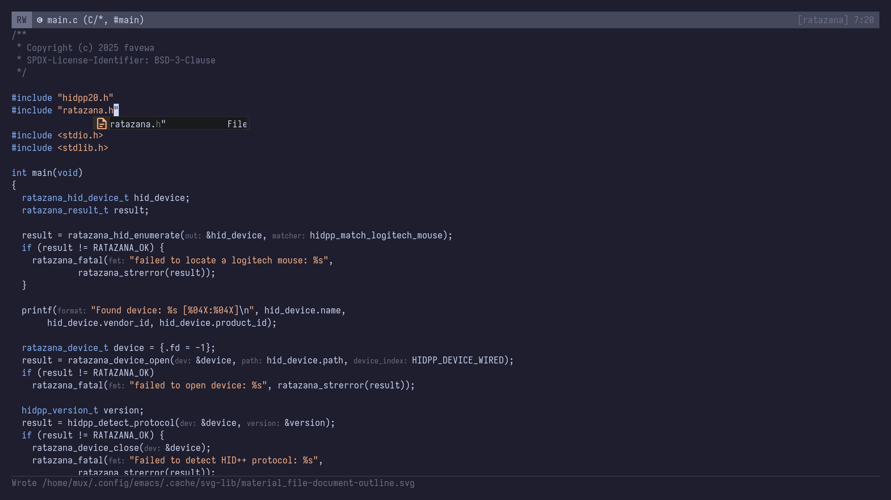

# pλimacs

wip newbie-friendly emacs distribution

### screenshots

<div>
  
  
</div>

### todo

- [ ] clean up the codebase
- [ ] `expand-region`
- [ ] `rainbow-delimiters`
- [ ] auto formatting

### installation

```bash
git clone https://github.com/rcxe/paimacs ~/.emacs.d
```

### commands

#### utilities

- `M-x paimacs-info` - about this distribution
- `M-x paimacs-open-user-config` - open user.el

### keybindings

#### quick help

- `M-p` - Show quick help message
- `C-c g` - consult ripgrep shortcut
- `C-c b` - consult buffer shortcut
- `C-x k` - kill current buffer

#### frame management

- `M-n` - create new frame
- `M-\`` - switch to other frame
- `M-RET` - toggle frame maximization

#### completion

- `TAB` - next completion candidate
- `S-TAB` - previous completion candidate

#### buffer & file management

- `C-x b` - switch buffer (consult-buffer)
- `C-x 4 b` - switch buffer in other window
- `C-x 5 b` - switch buffer in other frame
- `C-x r b` - jump to bookmark

#### navigation (M-g prefix)

- `M-g e` - jump to compile error
- `M-g g` / `M-g M-g` - go to line
- `M-g o` - jump to outline heading
- `M-g m` - jump to mark
- `M-g k` - jump to global mark
- `M-g i` - jump to imenu item
- `M-g I` - jump to imenu item (multi-buffer)

#### search (M-s prefix)

- `M-s d` - find file (consult-find)
- `M-s D` - locate file (consult-locate)
- `M-s g` - grep search
- `M-s G` - git grep search
- `M-s r` - ripgrep search
- `M-s l` - search current buffer lines
- `M-s L` - search lines across buffers
- `M-s k` - keep matching lines
- `M-s u` - focus on matching lines

#### lsp

- `C-c l r` - rename symbol
- `C-c l a` - code actions
- `C-c l f` - format region
- `C-c l F` - format entire buffer
- `C-c l d` - go to definition
- `C-c l R` - find references
- `C-c l h` - show documentation (eldoc)
- `C-c l s` - search workspace symbols (consult-eglot)

#### helpful

- `C-h f` - describe function (helpful-callable)
- `C-h v` - describe variable (helpful-variable)
- `C-h k` - describe key (helpful-key)

#### which-key

- `C-.` - Embark act (context actions)
- `C-;` - Embark dwim (do what I mean)

#### completion at point

- `C-c p` - cape prefix map for various completion sources

#### marginalia

- `M-A` - cycle marginalia annotations (in minibuffer)

### font settings

edit it in `paimacs-appearance.el`:

```elisp
(setq nano-font-family-monospaced "Your Font Name")
(setq nano-font-size 16)
```

### theme

currently using catppuccin mocha. the theme is defined in `paimacs-theme-catppuccin-mocha.el`

### lsp servers

add custom lsp server configurations in `paimacs-lsp.el`:

```elisp
(add-to-list 'eglot-server-programs
  '(your-mode . ("your-lsp-server" "args")))
```

### requirements

- emacs 29.1 or later
- git (for elpaca package manager)
- ripgrep (optional, for fast searching)
- lsp servers for your languages (install separately)

### credits

Built on top of:

- [N Λ N O Emacs](https://github.com/rougier/nano-emacs) by Nicolas P. Rougier
- numerous excellent emacs packages ^\_^
